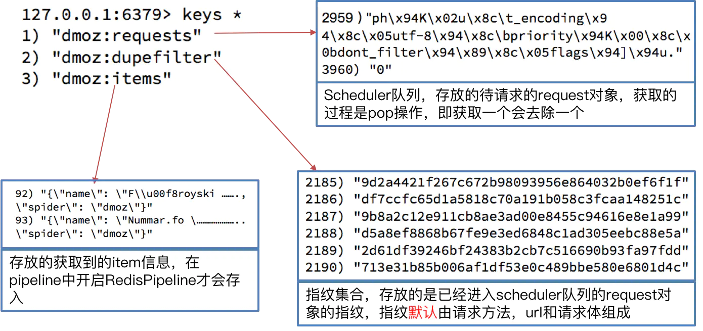

# scrapy中间件的使用

> **学习目标：**
> 1. 应用scrapy中间件使用随机UA方法
> 2. 应用scrapy中使用代理ip的方法
> 3. 应用scrapy与selenium配合使用

## 1. scrapy中间件的分类和作用

**1.1 scrapy中间件的分类**

根据scrapy运行流程中所在位置不同分为：

1. 下载中间件
2. 爬虫中间件

**1.2 scrapy中间件的作用：预处理request和response对象**

1. 对header以及cookie进行更换以及处理
2. 使用代理ip
3. 对请求进行定制化操作

在scrapy默认的情况下，两种中间件都在middlewares.py一个文件中
爬虫中间件使用方法和下载中间件相同，且功能重复，***通常使用下载中间件***

## 2. 下载中间件的使用方法

> 编写一个Downloader Middlewares和我们编写一个pipeline一样，定义一个类，然后在settings中开启

Downloader Middlewares的默认方法：

* process_request(self, request, spider):
  * 当每个request通过下载中间件的时候，该方法会被调用
  * 返回None值：没有return也是返回None值，该request对象传递给下载器，或通过引擎传递给其它权重低的process_request方法
  * 返回Response对象：不再请求，把response返回给引擎
  * 返回Request对象：把request对象通过引擎交给调度器对象，此时将不再通过其它权重低的process_request方法

* process_response(self, request, response, spider):
  * 当下载器完成http请求，传递响应给引擎的时候调用
  * 返回Response对象：通过引擎交给爬虫处理或交给权重更低的其它下载器中间件的process_response方法
  * 返回Request对象：通过引擎交给调度器继续请求，此时将不再通过其它权重低的process_request方法

* 在settings.py中配置开启中间件，权重越小越先执行

## 3. 定义实现随机User-Agent的下载中间件

### 3.1 在middlewares.py中完善代码

```python
import random
from scrapy import signals
from Douban.settings import USER_AGENT_LIST

# useful for handling different item types with a single interface
from itemadapter import is_item, ItemAdapter


class RandomUserAgent(object):

    def process_request(self, request, spider):
        # print(request.headers)
        ua = random.choice(USER_AGENT_LIST)
        request.headers['User-Agent'] = ua
```

### 3.2 在settings.py中设置开启自定义的下载插件，设置方法同管道

```python
DOWNLOADER_MIDDLEWARES = {
   # 'Douban.middlewares.DoubanDownloaderMiddleware': 543,
    'Douban.middlewares.RandomUserAgent': 543,
}
```

### 3.3 在settings中添加UA列表

```python
# USER_AGENT = 'Mozilla/5.0 (Windows NT 10.0; Win64; x64) AppleWebKit/537.36 (KHTML, like Gecko) Chrome/84.0.4147.89 Safari/537.36'

USER_AGENT_LIST = ['Mozilla/5.0 (compatible; U; ABrowse 0.6; Syllable) AppleWebKit/420+ (KHTML, like Gecko)',
           'Mozilla/5.0 (compatible; U; ABrowse 0.6;  Syllable) AppleWebKit/420+ (KHTML, like Gecko)',
           'Mozilla/5.0 (compatible; MSIE 8.0; Windows NT 6.0; Trident/4.0; Acoo Browser 1.98.744; .NET CLR 3.5.30729)',
           'Mozilla/5.0 (compatible; MSIE 8.0; Windows NT 6.0; Trident/4.0; Acoo Browser 1.98.744; .NET CLR   3.5.30729)',
           'Mozilla/4.0 (compatible; MSIE 8.0; Windows NT 6.0; Trident/4.0;   Acoo Browser; GTB5; Mozilla/4.0 (compatible; MSIE 6.0; Windows NT 5.1;   SV1) ; InfoPath.1; .NET CLR 3.5.30729; .NET CLR 3.0.30618)',
           'Mozilla/4.0 (compatible; MSIE 8.0; Windows NT 5.1; Trident/4.0; SV1; Acoo Browser; .NET CLR 2.0.50727; .NET CLR 3.0.4506.2152; .NET CLR 3.5.30729; Avant Browser)',
           'Mozilla/4.0 (compatible; MSIE 7.0; Windows NT 6.0; Acoo Browser; SLCC1;   .NET CLR 2.0.50727; Media Center PC 5.0; .NET CLR 3.0.04506)',
           'Mozilla/4.0 (compatible; MSIE 7.0; Windows NT 6.0; Acoo Browser; GTB5; Mozilla/4.0 (compatible; MSIE 6.0; Windows NT 5.1; SV1) ; Maxthon; InfoPath.1; .NET CLR 3.5.30729; .NET CLR 3.0.30618)',
           'Mozilla/4.0 (compatible; Mozilla/5.0 (compatible; MSIE 8.0; Windows NT 6.0; Trident/4.0; Acoo Browser 1.98.744; .NET CLR 3.5.30729); Windows NT 5.1; Trident/4.0)',
           'Mozilla/4.0 (compatible; Mozilla/4.0 (compatible; MSIE 8.0; Windows NT 5.1; Trident/4.0; GTB6; Acoo Browser; .NET CLR 1.1.4322; .NET CLR 2.0.50727); Windows NT 5.1; Trident/4.0; Maxthon; .NET CLR 2.0.50727; .NET CLR 1.1.4322; InfoPath.2)',
           'Mozilla/4.0 (compatible; MSIE 8.0; Windows NT 6.0; Trident/4.0; Acoo Browser; GTB6; Mozilla/4.0 (compatible; MSIE 6.0; Windows NT 5.1; SV1) ; InfoPath.1; .NET CLR 3.5.30729; .NET CLR 3.0.30618)'
           ]
```

运行爬虫观察现象

## 4. 代理ip的使用

### 4.1 思路分析

1. 代理添加的位置：request.meta中添加proxy字段
2. 获取一个代理ip，赋值给request.meta['proxy']
   * 代理池中随机选择代理ip
   * 代理ip的webapi发送请求获取一个代理ip

### 4.1.1 在middlewares.py中完善代码

```python
import random
import base64
from scrapy import signals
from Douban.settings import USER_AGENT_LIST, PROXY_LIST


class RandomProxy(object):

    def process_request(self, request, spider):
        proxy = random.choice(PROXY_LIST)

        if 'user_passwd' in proxy:
            # 对帐号密码进行编码
            b64_up = base64.b64encode(proxy['user_passwd'].encode()) # 传入的是bytes类型
            # 设置认证
            request.headers['proxy-Authorization'] = 'Basic ' + b64_up.decode() # Basic后面要跟空格
            # 设置代理
            request.meta['proxy'] = proxy['ip_port']
        else:
            # 设置代理
            request.meta['proxy'] = proxy['ip_port']
```

### 4.1.2 在settings.py中设置开启自定义的下载插件，设置方法同管道

```python
DOWNLOADER_MIDDLEWARES = {
   # 'Douban.middlewares.DoubanDownloaderMiddleware': 543,
    #'Douban.middlewares.RandomUserAgent': 543,
    'Douban.middlewares.RandomProxy': 543,
}
```

### 4.1.3 在settings中添加Proxy列表

```python
PROXY_LIST = [
    {"ip_port":"123.207.53.84:16816", "user_passwd":"morganna_mode_g:gcc22qxp"}, # 收费代理ip,有账号密码
    {"ip_port":"122.234.206.43:9000"} # 免费代理ip
]
``` 

## 5. 在中间件中使用selenium

### 5.1 在srapy的middlewares.py中使用selenium

```python
import time
from selenium import webdriver
from scrapy.http import HtmlResponse
from scrapy import signals


class SeleniumMiddleware(object):

    def process_request(self, request, spider):
        url = request.url

        if "daydata" in url:
            driver = webdriver.Chrome()

            driver.get(url)
            time.sleep(3)
            data = driver.page_source

            driver.close()

            # 创建响应对象
            res = HtmlResponse(url=url, body=data, encoding='utf-8', request=request)

            return res
```

### 5.2 在setting.py文件中设置开启自定义的下载插件，设置方法同管道

```python
DOWNLOADER_MIDDLEWARES = {
   # 'Douban.middlewares.DoubanDownloaderMiddleware': 543,
    'Douban.middlewares.SeleniumMiddleware':544,
}
```

## 6. scrapy_redis的概念

> **学习目标**
> 1. 了解scrapy_redis的概念
> 2. 了解scrapy_redis的作用
> 3. 了解scrapy_redis的工作流程

***
> 如果当前网站的数据量巨大，我们就需要分布式来更快的爬取数据

### 6.1 什么是分布式

> 简单地说 分布式就是不同的节点（服务器，ip不同）共同完成一个任务

### 6.2 scrapy_redis的概念

scrapy_redis是scrapy框架的基于redis的分布式组件

### 6.3 scrapy_redis的作用

> scrapy_redis在scrapy的基础之上实现了更多，更强大的功能，具体体现在:

通过持久化请求队列和请求的指纹集合来实现：

* 断点续爬

* 分布式快速抓取

### 6.4 scrapy_redis的工作流程

* 在scrapy_redis中，所有的待抓取的request对象和去重的request对象指纹都存在所有服务器公用的redis中

* 所有的服务器中的scrapy进程公用同一个redis中的request对象的队列

* 所有的request对象存入redis前，都会通过该redis中的request指纹集合进行判断，之前是否已经存入过

* 在默认情况下所有的数据会保存在redis中

具体流程如下：


## 7. scrapy_redis原理分析并实现断点续爬以及分布式爬虫

> **学习目标**
> 1. 了解scrapy实现去重的原理
> 2. 了解scrapy中请求入队的条件
> 3. 掌握rscrapy_redis基于url地址的增量式单机爬虫
> 4. 掌握scrapy_redis分布式爬虫

### 7.1 下载github的demo代码

* clone github scrapy_redis源码文件

```git
git clone https://github.com/rolando/scrapy-redis.git
```

* 研究项目自带的demo

### 7.2 观察dmoz文件

在dmoz爬虫文件中，实现方式就是之前的crawlspider类型的爬虫

```python
from scrapy.linkextractors import LinkExtractor
from scrapy.spiders import CrawlSpider, Rule


class DmozSpider(CrawlSpider):
    """Follow categories and extract links."""
    name = 'dmoz'
    allowed_domains = ['dmoz-odp.org']
    start_urls = ['http://www.dmoz-odp.org/']

    # 定义数据提取规则，使用了css选择器
    rules = [
        Rule(LinkExtractor(
            restrict_css=('.top-cat', '.sub-cat', '.cat-item')
        ), callback='parse_directory', follow=True),
    ]

    def parse_directory(self, response):
        for div in response.css('.title-and-desc'):
            yield {
                'name': div.css('.site-title::text').extract_first(),
                'description': div.css('.site-descr::text').extract_first().strip(),
                'link': div.css('a::attr(href)').extract_first(),
            }

```

但是在settings.py中多了以下内容，这几行表示scrapy_redis中重新实现了去重的类，以及调度器，并且使用RedisPipeline管道类

```python

# 设置重复过滤器的模块，不设置则使用的是python的集合过滤
DUPEFILTER_CLASS = "scrapy_redis.dupefilter.RFPDupeFilter"
# 设置调度器，scrapy_redis的调度器具备与数据库交互的能力
SCHEDULER = "scrapy_redis.scheduler.Scheduler"
# 设置当爬虫结束时是否保持redis数据库中的去重集合与任务队列
SCHEDULER_PERSIST = True

# 管道定义
ITEM_PIPELINES = {
    'example.pipelines.ExamplePipeline': 300,
    # 当开启该管道，该管道将会把数据存到Redis数据库中
    'scrapy_redis.pipelines.RedisPipeline': 400,
}

```

### 7.3 运行dmoz爬虫，观察现象

**1. 首先我们需要添加redis的地址，程序才能使用redis:**

```python

# 设置redis数据库
REDIS_URL = "redis://xxx.xxx.xxx.xxx:6379"

# 或者使用下面的方式
# REDIS_HOST = "xxx.xxx.xxx.xxx"
# REDIS_PORT = 6379

```

**2. 在我们执行dmoz爬虫后，会发现redis中多了以下三个键：**



```shell

127.0.0.1:6379> keys *
1) "dmoz:requests"      # Scheduler队列，存放待请求的request对象，获取的过程是pop操作，取一个除一个
2) "dmoz:dupefilter"    # 指纹集合，存放的是已经进入scheduler队列的request对象的指纹，指纹默认由请求方法，url和请求体组成
3) "dmoz:items"         # 存放的是获取到的item信息，在pipeline中开启RedisPipeline才会存入

```

**3. 在中止进程后再次运行dmoz爬虫：**

继续执行程序，会发现程序在上一次的基础之上继续向后执行，**所以dmoz爬虫是一个基于url地址的增量式爬虫**

### 7.4 scrapy_redis的原理分析

我们从settings.py中的三个配置来进行分析：

```python

* RedisPipeline # 管道类
* RFPDupeFilter # 指纹去重类
* Scheduler # 调度器类
* SCHEDULER_PERSIST # 是否持久化请求队列和指纹集合

```

#### 7.4.1 Scrapy_redis之RedisPipeline

RedisPipeline中观察process_item，进行数据的保存，存入了redis中


#### 7.4.2 Scrapy_redis之RFPDupeFilter

RFPDupeFilter 实现了对request对象的加密


#### 7.4.3 Scrapy_redis之Scheduler

scrapy_redis调度器的实现了决定什么时候把request对象加入带抓取的队列，同时把请求过的request对象过滤掉


#### 7.4.4 由此可以总结出request对象入队的条件

* request的指纹不在集合中
* request的dont_filter为True，即不过滤
* start_urls中的url地址会入队，因为他们默认是不过滤

## 8. 实现分布式爬虫

### 8.1 分析demo中代码

> 打开example-project项目中的myspider_redis.py文件

**通过观察代码：**

1. 继承自父类为RedisSpider

2. 增加了一个redis_key的键，没有start_urls，因为分布式中，如果每台电脑都请求一次start_url就会重复

3. 多了__init__方法，该方法不是必须的，可以手动指定allow_domains

4. **启动方法：**
1.在每个节点正确的目录下执行*scrapy crawl* 爬虫名，使该节点的scrapy_redis爬虫程序就位
2.在共用的redis中 *lpush redis_key 'start_url'*，使全部节点真正的开始运行

5.settings.py中关键的配置

```python

# 设置重复过滤器的模块，不设置则使用的是python的集合过滤
DUPEFILTER_CLASS = "scrapy_redis.dupefilter.RFPDupeFilter"
# 设置调度器，scrapy_redis的调度器具备与数据库交互的能力
SCHEDULER = "scrapy_redis.scheduler.Scheduler"
# 设置当爬虫结束时是否保持redis数据库中的去重集合与任务队列
SCHEDULER_PERSIST = True

# 管道定义
ITEM_PIPELINES = {
    'example.pipelines.ExamplePipeline': 300,
    # 当开启该管道，该管道将会把数据存到Redis数据库中
    'scrapy_redis.pipelines.RedisPipeline': 400,
}

# 设置redis数据库
REDIS_URL = "redis://xxx.xxx.xxx.xxx:6379"
```

### 8.2 分布式爬虫编写流程

1. 编写一个普通爬虫
    * 创建项目
    * 明确目标
    * 创建爬虫
    * 保存内容

2. 改造普通爬虫为分布式爬虫
    1. 改造爬虫
        1. 导入scrapy_redis中的分布式爬虫类
        2. 继承类
        3. 注销 start_urls & allowed--domains
        4. 设置 redis_key 获取 start_urls
        5. 设置 \_\_init\_\_ 获取允许的域
    2. 改造配置文件
        * copy配置参数

## 小结

1. scrapy_redis的含义和能够实现的功能

    * scrapy是框架
    * scrapy_redis是scrapy的组件
    * scrapy_redis能够实现断点续爬和分布式爬虫

2. scrapy_redis流程和实现原理
    1. 在scrapy框架流程的基础上，把存储request对象放到了redis的有序集合中，利用该有序集合实现了请求队列
    2. 并对request对象生成指纹对象，也存储到同一redis的集合中，利用request指纹避免发送重复的请求

3. request对象进入队列的条件

    1. request的指纹不在集合中
    2. request的dont_filter为True，即不过滤

4. request指纹的实现

    * 请求方法
    * 排序后的请求地址
    * 排序并处理过的请求体或空字符串
    * 用hashlib.sha1()对以上内容进行加密

5. scarpy_redis实现增量式爬虫、布式爬虫

    1.对setting进行如下设置

    ```python
    DUPEFILTER_CLASS = "scrapy_redis.dupefilter.RFPDupeFilter"
    SCHEDULER = "scrapy_redis.scheduler.Scheduler"
    SCHEDULER_PERSIST = True
    ITEM_PIPELINES = {'scrapy_redis.pipelines.RedisPipeline': 400,}
    REDIS_URL = "redis://127.0.0.1:6379" # 请正确配置REDIS_URL
    ```

    2.爬虫文件中的爬虫类继承RedisSpider类
    3.爬虫类中redis_key替代了start_urls
    4.启动方式不同
    * 通过scrapy crawl spider启动爬虫后，向redis_key放入一个或多个起始url（lpush或rpush都可以），才能够让scrapy_redis爬虫运行

    5.除了以上差异点以外，scrapy_redis爬虫和scrapy爬虫的使用方法都是一样的
